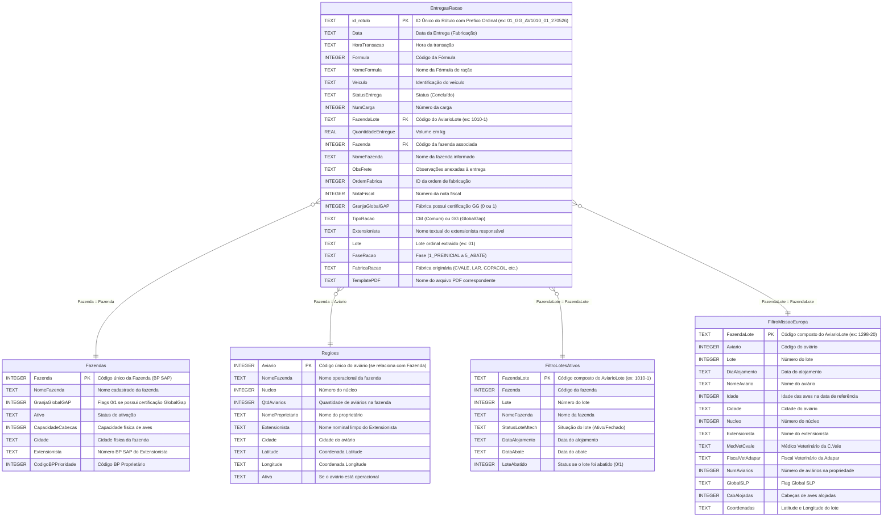

# Modelo Entidade-Relacionamento (MER)

Este documento apresenta a modelagem lógica do banco de dados relacional (SQLite) criado para o sistema de Reimpressão de Rótulos. A arquitetura de dados segue o modelo dimensional (Estrela/Star Schema), ideal para consultas rápidas e geração de estatísticas, no qual a tabela fato `EntregasRacao` conecta-se às dimensões `Fazendas` (cadastro geral) e `Regioes` (cadastro operacional e extensionistas).

---

## 📌 Visão Geral do Star Schema

---

## 📋 Dicionário de Dados

### 1. Tabela Fato: `EntregasRacao`
Contém todas as entregas concluídas que estão aptas a gerar rótulos retroativos.

| Campo | Tipo no SQLite | Descrição | Origem |
| :--- | :--- | :--- | :--- |
| `id_rotulo` | TEXT (PK) | Chave primária. Identificador único do rótulo retroativo. Formato: `{Sequencial_XX}_{TipoRacao}_AV{Fazenda}_{Lote}_{DataFabricacao_DDMMAA}`. O prefixo sequencial garante a ordenação cronológica das cargas de um aviário-lote no sistema de arquivos. | Feature Extraída |
| `Data` | TEXT | Data da entrega em formato ISO (`YYYY-MM-DD`). Corresponde à data de fabricação para o rótulo. | `EntregasMtech.xlsx` |
| `HoraTransacao` | TEXT | Hora do registro da entrega no sistema. | `EntregasMtech.xlsx` |
| `Formula` | INTEGER | Código da fórmula de ração. | `EntregasMtech.xlsx` |
| `NomeFormula` | TEXT | Nome descritivo da fórmula de ração. | `EntregasMtech.xlsx` |
| `Veiculo` | TEXT | Placa/Código do veículo que efetuou a entrega. | `EntregasMtech.xlsx` |
| `StatusEntrega` | TEXT | Status final da entrega (filtrado para 'Concluído'). | `EntregasMtech.xlsx` |
| `NumCarga` | INTEGER | Número identificador do carregamento. | `EntregasMtech.xlsx` |
| `FazendaLote` | TEXT | Identificador composto da entrega (Fazenda + Lote composto). Ex: `1351-1`. | `EntregasMtech.xlsx` |
| `QuantidadeEntregue` | REAL | Quantidade de ração em kg. | `EntregasMtech.xlsx` |
| `Fazenda` | INTEGER (FK) | Código de relacionamento com aviários/fazendas. | `EntregasMtech.xlsx` |
| `NomeFazenda` | TEXT | Nome da fazenda registrado na nota de entrega. | `EntregasMtech.xlsx` |
| `ObsFrete` | TEXT | Anotações do frete, usadas para extrair a fábrica parceira se houver. | `EntregasMtech.xlsx` |
| `OrdemFabrica` | INTEGER | Código da ordem de fabricação SAP. | `EntregasMtech.xlsx` |
| `NotaFiscal` | INTEGER | Número da Nota Fiscal de entrega. | `EntregasMtech.xlsx` |
| `Granja Global GAP` | INTEGER | Booleano (0 ou 1) indicando se a fazenda é certificada GlobalGap. | Juntado de `Fazendas` |
| `TipoRacao` | TEXT | Tipo de rótulo a ser emitido: `GG` (GlobalGap) ou `CM` (Comum). | Feature Extraída |
| `Extensionista` | TEXT | Nome textual legível do Extensionista responsável. | Juntado de `Regioes` |
| `Lote` | TEXT | Lote ordinal normalizado com zero à esquerda (ex: `01`, `12`). | Feature Extraída |
| `FaseRacao` | TEXT | Fase da ração (`1_PREINICIAL`, `2_INICIAL1`, `3_INICIAL2`, `4_CRESCIMENTO`, `5_ABATE`). | Feature Extraída |
| `FabricaRacao` | TEXT | Fábrica de origem da ração (`CVALE`, `LAR`, `COPACOL`, `AGRIFIRM`, `COAMO`). | Feature Extraída |
| `TemplatePDF` | TEXT | Nome exato do arquivo PDF do template configurado em `/assets/RotulosTemplate`. | Feature Extraída |

### 2. Tabela Dimensão: `Fazendas`
Dados cadastrais das fazendas extraídos do cadastro corporativo.

| Campo | Tipo no SQLite | Descrição |
| :--- | :--- | :--- |
| `Fazenda` | INTEGER (PK) | Código numérico exclusivo da Fazenda (Business Partner SAP). |
| `Nome Fazenda` | TEXT | Nome corporativo da propriedade rural. |
| `Granja Global GAP` | INTEGER | Flag booleano (0 ou 1) se possui a certificação GlobalGap. |
| `Ativo` | TEXT | Status se a propriedade está ativa. |
| `Capacidade Cabeças` | INTEGER | Lotação máxima de aves suportada. |
| `Cidade` | TEXT | Município de localização. |
| `Extensionista` | TEXT | Código numérico (BP SAP) do Extensionista. |
| `Código BP Propriedade` | INTEGER | Código Business Partner da propriedade. |

### 3. Tabela Dimensão: `Regioes`
Dados cadastrais operacionais de aviários e a regionalização do atendimento veterinário.

| Campo | Tipo no SQLite | Descrição |
| :--- | :--- | :--- |
| `Aviario` | INTEGER (PK) | Código numérico do aviário (corresponde a Fazenda na Fato). |
| `NomeFazenda` | TEXT | Nome fantasia da fazenda. |
| `Nucleo` | INTEGER | Código do núcleo dentro da fazenda. |
| `QtdAviarios` | INTEGER | Número total de galpões/aviários instalados. |
| `NomeProprietario` | TEXT | Nome completo do proprietário rural. |
| `Extensionista` | TEXT | Nome próprio legível do Veterinário/Técnico de campo (ex: `Rodrigo`, `Debora`). |
| `Cidade` | TEXT | Cidade de localização física. |
| `Latitude` | TEXT | Latitude (geolocalização). |
| `Longitude` | TEXT | Longitude (geolocalização). |
| `Ativa` | TEXT | Status se está ativa para alojamento. |

### 4. Tabela Dimensão: `FiltroLotesAtivos`
Contém a listagem dos lotes com seus respectivos status e datas de controle, servindo como base para a filtragem operacional no ETL.

| Campo | Tipo no SQLite | Descrição |
| :--- | :--- | :--- |
| `FazendaLote` | TEXT (PK) | Chave primária. Código composto do lote (`{Fazenda}-{Lote}`). |
| `Fazenda` | INTEGER | Código do aviário/fazenda. |
| `Lote` | INTEGER | Número/ciclo do lote. |
| `NomeFazenda` | TEXT | Nome da fazenda. |
| `StatusLoteMtech` | TEXT | Situação do lote (`Ativo`, `Fechado`). |
| `DataAlojamento` | TEXT | Data de alojamento em formato ISO (`YYYY-MM-DD`). |
| `DataAbate` | TEXT | Data de abate em formato ISO (`YYYY-MM-DD`), ou `NULL` caso ativo. |
| `LoteAbatido` | INTEGER | Flag booleano indicando se o lote foi abatido (1 = Verdadeiro, 0 = Falso). |

### 5. Tabela Dimensão: `FiltroMissaoEuropa`
Tabela com os lotes selecionados para a auditoria de exportação para a Europa. Restringe a geração final de rótulos.

| Campo | Tipo no SQLite | Descrição |
| :--- | :--- | :--- |
| `FazendaLote` | TEXT (PK) | Chave primária. Código composto do lote (`{Aviário}-{Lote}`). |
| `Aviário` | INTEGER | Código do aviário (fazenda). |
| `Lote` | INTEGER | Número do lote. |
| `Dia do Aloj` | TEXT | Data do alojamento em formato ISO (`YYYY-MM-DD`). |
| `Nome Aviário` | TEXT | Nome operacional do aviário/produtor. |
| `Idade (06/07)` | INTEGER | Idade das aves na data de referência da auditoria. |
| `Cidade` | TEXT | Cidade de localização. |
| `Núcleo` | INTEGER | Código do núcleo. |
| `Extensionista` | TEXT | Extensionista responsável. |
| `Méd. Veterinário C.Vale` | TEXT | Médico veterinário da C.Vale. |
| `Fiscal Veterinário Adapar` | TEXT | Fiscal veterinário da Adapar. |
| `Número aviários` | INTEGER | Total de aviários na fazenda. |
| `Global SLP` | TEXT | Status Global SLP. |
| `Cab. Alojadas` | INTEGER | Quantidade de cabeças de aves alojadas. |
| `Coordenadas` | TEXT | Geolocalização (Latitude e Longitude). |
| `Link` | TEXT | Link do mapa de localização. |
